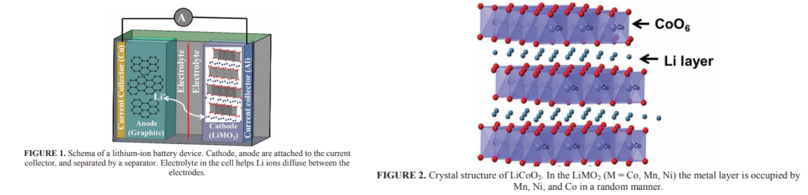
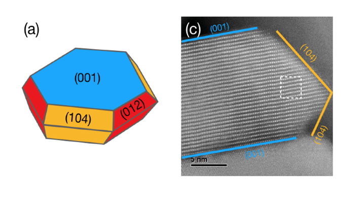

## Course Project 
1. [Introduction](#intro)
2. [Deadlines](#deadlines)
3. [Calculations](#calcs)
4. [Analysis](#analysis)
5. [Final Report](#report)


For the Final Project, you will be studying ethylene carbonate adosrption on Lithium Cobalt Oxide (LiCoO<sub>2</sub>) with different dopant metals. Each group will be assigned a metal dopant to work with (see list of Assigned Projects). The students will work in groups of two or three on the same MXene to perform calculations individually, however, complementing each other. Each pair of students will present their results in class that will be critiqued by another group of two. Finally, each group  will jointly write a final report on the combined data. The due date for the final written report is <font color="red">5/8 at 5:00 PM (hard deadline)</font>.

Please make use of the [Piazza](https://piazza.com/) page for troubleshooting, discussions and for sharing results.

Turn in your final report by emailing a PDF file to:

```
alevoj@seas.upenn.edu, antcurto@seas.upenn.edu
```

<a name='intro'></a>

 ## Introduction ##

Goal: Understand how different metal dopants affect the structure and reactivity of LiCoO2 specifically through the adsorption of ethylene carbonate (EC).

Plan: Use DFT to study dopant effects on structure and changes it causes to EC adsorption on the surface of LiCoO2. Study the electronic structure of LiCoO2 and doped LiCoO2 to see if any trends exist.

Motivation

LiMO2 (M= Co, Mn, Ni are the most common cathode materials in batteries today. LiCoO2 is by far the most popular of those materials. A combination of effects has lead to investigations to improve the stability of LiCoO2 cathode materials or find suitable alternatives. Some problematic effects include cost, reactivity, structural problems. Decomposition of the liquid electrolyte is a common cause of decreased battery performance. Ethylene carbonate is a popular component of the elctrolyte solution in Li ion batteries. In order to improve battery performance critical importance in improving battery operation is understanding the electrode – electrolyte interface. For high capacity battery materials, electrolytes decomposed causing the battery to decrease in performance. 


<div style="text-align:center">
 
AIP Conference Proceedings 1597, 26 (2014); https://doi.org/10.1063/1.4878478 Published Online: 17 February 2015</div>

Ongoing work in the [Cabana Group](https://cabana.chem.uic.edu/) at UIC has shown that some metal dopants, specifically Al in LiCoO<sub>2</sub> can increase the lifetime of the batteries. Well defined nanocrystals of LiCoO<sub>2</sub> can be synthesized and subsequnetly test for battery performance. The Figure below shows a schematic of the nanocrystals synthesized at UIC. With this information we can model the individual facets of the nanocrystal and study the effect on EC adsorption metal dopants will have in each region. 

<div style="text-align:center"></div>


<a name='deadlines'></a>

## Deadlines ##
1. HW5 Due: Wed 10 April (Each student)
2. Short update (few slides) on completed calcualtions: Wed 17 April during class (per group)
3. Final Presentation: Wed 1 May during class (per group)
4. Final Paper: Wed 8 May by 5 PM (per group)

<a name='calcs'></a>

## Calculations ##

For the Final Project, create a `M-surf` or `M-subsurf' folder (M is the metal you are assigned, please check [Assignment](https://cbe544.github.io/Project_Assignments/)) in your `CBE544FinalProject` directory. For example, if you are assignemnt with Ni and you are running a surface calculation, please run the following command to create the directories: 

```bash
cd
cd CBE544
wget CBE544FinalProject
tar -zxvf CBE544FinalProject.tar.gz
cd CBE544FinalProject
mkidr Ni-surf
```

## Analysis ##

## Final Report ##

The final report should be in the form of a 3-5 pages long mini paper including figures and tables. One report for each group. Please be succinct and organize it in the following way:

* Introduction (brief) - don't write too much
* Calculation details
* Results and discussion
* Conclusion (brief)

You are welcome to share data amongst your peers to discuss broader trends. 

**If you need the energy of the fixed clusters, they are available [here](../Fixed_Lattice_Clusters/energies.txt).**

<a name='grading'></a>


## Requirements ##

At a minimum you should accomplish the following:

1. Complete the [three exercises](../ASE/Getting_Started).
2. Setup a LiCoO<sub>2</sub> surface (104) and calculate adsorption energies for EC adsorption as three sites for two different metal dopant locations (surface and sub-surface).
3. Do a Bader Charge Analysis on metal doped system and metal doped system w/ EC and compare to the provided systems without and dopant and with an Al dopant.
4. Repeat this process on the 001 facet. Instead of doing is for surface and subsurface we will do this for Li-terminated and CoO<sub>2</sub> terminated. 
5. Analysis
    1. How does the metal dopant affect adsorption vs plain LiCoO<sub>2</sub>? vs Al-doped? How is the adosrption different for surface vs sub-surface?
    2. Do you notice and trends from the bader charge analysis that may contribute to the change in adsorption?
6. Report (3~5 pages maximum)


